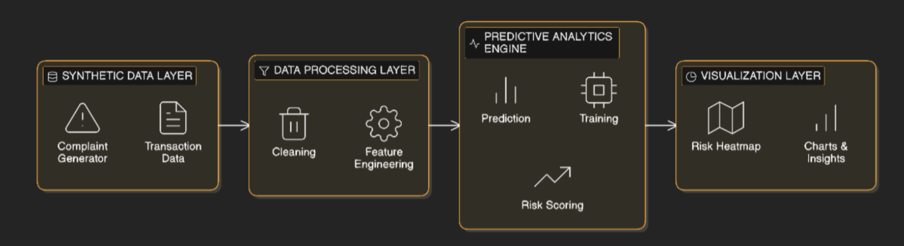

# CYBERCRIME-RISK-PREDICTION

# Cybercrime Predictive Analytics Framework

## 1. Problem Statement (Redefined)

Cybercrime complaints related to financial fraud are increasing rapidly, making reactive investigation insufficient. This project focuses on **using historical cybercrime complaint data to predict high-risk cash withdrawal locations**, enabling proactive intervention.
Instead of building a full-scale national system, this project **designs and implements a prototype predictive analytics framework** that demonstrates how data-driven intelligence can support law enforcement agencies and financial institutions in identifying potential withdrawal hotspots in advance.
The core objective is to transform raw complaint data into **actionable risk intelligence** using machine learning and geospatial analysis.

---

## 2. Project Objectives

* Analyze historical cybercrime complaint data to identify patterns related to fraudulent cash withdrawals
* Predict likely cash withdrawal locations or high-risk regions using ML models
* Generate location-based risk scores to support proactive monitoring
* Visualize predicted risk zones using a heatmap-style representation
* Demonstrate how alerts and intelligence could be triggered for stakeholders

## 3. System Architecture (Logical)

## 4. Technology Stack

* Python
* Pandas, NumPy
* Scikit-learn
* Matplotlib / Seaborn / Plotly / Folium (heatmap)
* Jupyter Notebook
* VS Code

## 5. Conclusion

This project presents a **data-driven, proactive approach to cybercrime mitigation** by predicting potential cash withdrawal locations from historical complaint data. While implemented as a prototype, the framework demonstrates how predictive analytics and risk intelligence can significantly enhance response speed and coordination between stakeholders.

---

**Author:** Niyati Sardana
