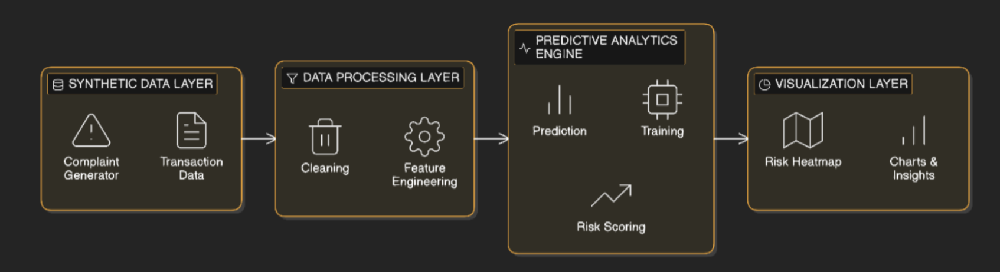
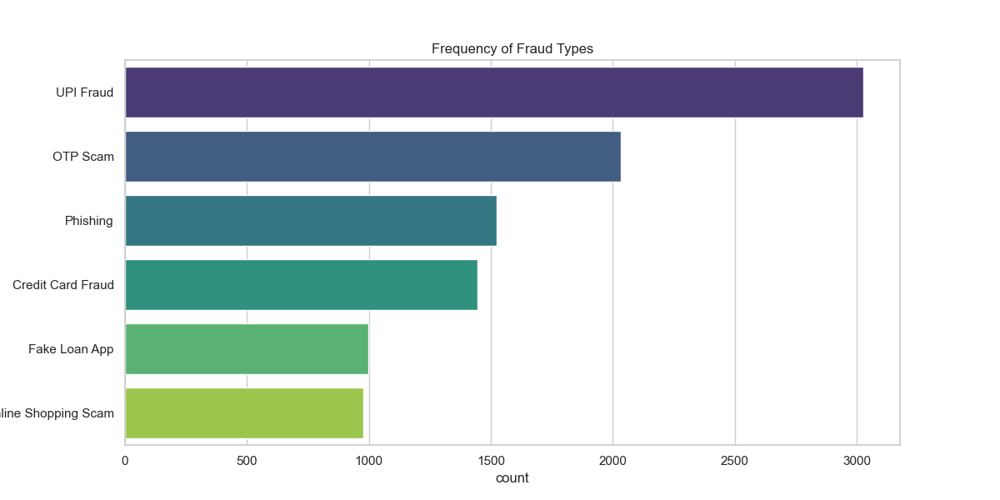
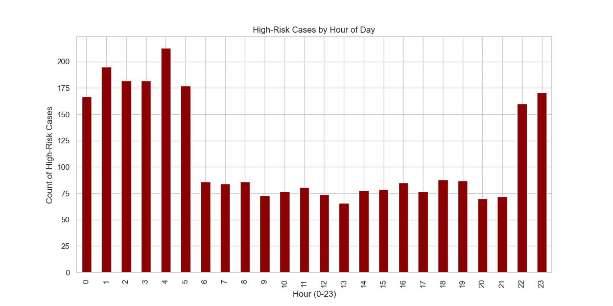
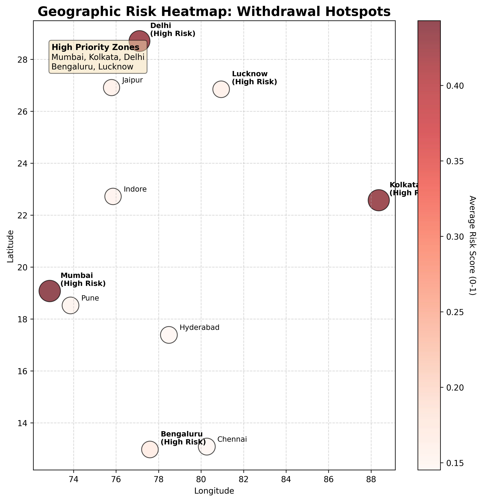
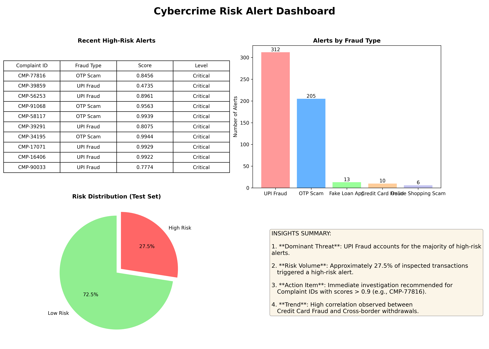

# CYBERCRIME-RISK-PREDICTION

# Cybercrime Predictive Analytics Framework

## 1. Problem Statement (Redefined)

Cybercrime complaints related to financial fraud are increasing rapidly, making reactive investigation insufficient. This project focuses on **using historical cybercrime complaint data to predict high-risk cash withdrawal locations**, enabling proactive intervention.
Instead of building a full-scale national system, this project **designs and implements a prototype predictive analytics framework** that demonstrates how data-driven intelligence can support law enforcement agencies and financial institutions in identifying potential withdrawal hotspots in advance.
The core objective is to transform raw complaint data into **actionable risk intelligence** using machine learning and geospatial analysis.

---

## 2. Project Objectives

* Analyze historical cybercrime complaint data to identify patterns related to fraudulent cash withdrawals
* Predict likely cash withdrawal locations or high-risk regions using ML models
* Generate location-based risk scores to support proactive monitoring
* Visualize predicted risk zones using a heatmap-style representation
* Demonstrate how alerts and intelligence could be triggered for stakeholders

## 3. System Architecture (Logical)



## 4. Technology Stack

* Python
* Pandas, NumPy
* Scikit-learn
* Matplotlib / Seaborn / Plotly / Folium (heatmap)
* Jupyter Notebook
* VS Code

## 5. Conclusion

This project presents a **data-driven, proactive approach to cybercrime mitigation** by predicting potential cash withdrawal locations from historical complaint data. While implemented as a prototype, the framework demonstrates how predictive analytics and risk intelligence can significantly enhance response speed and coordination between stakeholders.

---

**Author:** Niyati Sardana


# 🔐 Cybercrime Risk Prediction & Alert System

> A machine learning-based framework that predicts high-risk cybercrime zones across Indian cities and sends automated real-time alerts via email.

**Author:** Niyati Sardana

---

## 🧠 What Does This Project Do?

Most cybercrime response systems are **reactive** — they act after the crime has already happened. This project flips that around.

It analyzes historical cybercrime complaint data, trains an ML model to identify patterns, and then **predicts which cities are likely to see high fraud activity** — before it escalates. On top of that, it automatically sends email alerts to the right people using an **n8n automation workflow**.

In short:
- 📊 Analyze past fraud data
- 🤖 Predict future high-risk zones
- 🗺️ Visualize risk on a heatmap
- 🚨 Automatically send alerts via email

---

## 🏗️ System Architecture


The pipeline flows through 4 layers:
1. **Synthetic Data Layer** — generates realistic cybercrime complaint data
2. **Data Processing Layer** — cleans data and engineers features
3. **Predictive Analytics Engine** — trains the ML model and scores risk
4. **Visualization Layer** — produces heatmaps and dashboards

---

## 📁 Project Structure

```
CYBERCRIME-RISK-PREDICTION/
│
├── generate_dataset.py         # Generates synthetic cybercrime dataset
├── feature_engineering.py      # Creates ML-ready features from raw data
├── perform_eda.py              # Exploratory data analysis + plots
├── train_models.py             # Trains the classification model
├── generate_risk_intelligence.py # Aggregates city-level risk scores
├── simulate_alerts.py          # Generates + sends alerts to n8n
├── visualize_risk_heatmap.py   # Creates geographic risk heatmap
├── generate_alert_dashboard.py # Creates alert summary dashboard
│
├── cybercrime_dataset.csv      # Main dataset
├── city_risk_stats.csv         # Aggregated risk per city
├── generated_alerts.json       # Latest alert output
│
├── X_train.csv / y_train.csv   # Training data
├── X_test.csv  / y_test.csv    # Test data
│
├── risk_heatmap.png            # Geographic risk visualization
├── alert_dashboard.png         # Alert summary dashboard
├── architecture.png            # System architecture diagram
└── eda_plots/                  # All EDA charts
```

---

## 📊 Dataset Overview

The dataset contains cybercrime transactions across **10 major Indian cities**:

`Mumbai · Delhi · Kolkata · Bangalore · Chennai · Hyderabad · Jaipur · Lucknow · Indore · Ahmedabad`

**Crime Types covered:**
- UPI Fraud
- OTP Scam
- Phishing
- Credit Card Fraud
- Fake Loan App
- Online Shopping Scam

**Key Features used for prediction:**

| Feature | Description |
|---|---|
| `fraud_amount` | Amount involved in the fraud |
| `time_to_withdrawal` | How fast money was withdrawn after fraud |
| `complaint_hour` | Hour of day the complaint was filed |
| `day_of_week` | Day the fraud occurred |
| `is_night` | Whether fraud happened at night (0/1) |
| `log_fraud_amount` | Log-transformed amount (handles outliers) |
| `amount_bucket_encoded` | Low / Medium / High bucket |
| `type_*` | One-hot encoded crime type columns |
| `victim_city_encoded` | City encoded as a number |
| `is_high_risk` | 🎯 **Target variable** (1 = High Risk, 0 = Normal) |

---

## 📈 Exploratory Data Analysis

### Fraud Type Frequency


UPI Fraud is the dominant crime type, followed by OTP Scams and Phishing.

### High-Risk Cases by Hour of Day


Fraud spikes heavily during **midnight to 5 AM** — a key insight used in the `is_night` feature.

---

## 🤖 Model Training

The ML model is a **binary classifier** — it predicts whether a transaction is:
- `1` → **High Risk**
- `0` → **Normal**

**Training flow:**
1. Raw data → Feature Engineering (`feature_engineering.py`)
2. Train/Test split → `X_train`, `X_test`, `y_train`, `y_test`
3. Model trained on `X_train` (`train_models.py`)
4. Each transaction gets a **risk score between 0 and 1**
5. Score > 0.5 → flagged as High Risk
6. Scores aggregated per city → `city_risk_stats.csv`

---

## 🗺️ Geographic Risk Heatmap



Cities with the highest average risk scores (darker = more dangerous):

| City | Avg Risk Score | Status |
|---|---|---|
| Mumbai | 0.4429 | 🔴 HIGH |
| Kolkata | 0.4329 | 🔴 HIGH |
| Delhi | 0.4299 | 🔴 HIGH |

> Threshold: Any city with Avg Risk Score > **0.40** is flagged as a hotspot.

---

## 🚨 Alert Dashboard



The dashboard shows:
- **Recent High-Risk Alerts** with complaint IDs and scores
- **Alerts by Fraud Type** — UPI Fraud dominates (312 alerts)
- **Risk Distribution** — 27.5% of transactions are high risk
- **Insights Summary** — key findings and recommended actions

---

## ⚡ Alert System — How It Works

Alerts are generated by `simulate_alerts.py` and automatically sent via **n8n automation**.

### Two Types of Alerts

| Alert Type | Severity | Trigger | Example |
|---|---|---|---|
| `ZONE_RED_FLAG` | 🔴 HIGH | Avg Risk Score > 0.40 | Mumbai score = 0.4429 |
| `SURGE_WARNING` | 🚨 CRITICAL | Sudden spike in fraud rate | Jaipur: 50 events/hr vs normal 5 (+900%) |

### n8n Workflow (3 Nodes)

```
[Webhook] → [IF: severity == HIGH or CRITICAL] → [Gmail: Send Alert Email]
```

1. `simulate_alerts.py` generates alerts and POSTs them to the n8n webhook
2. The **IF node** filters only HIGH and CRITICAL alerts
3. The **Gmail node** sends a formatted HTML email instantly

### Sample Alert Email Received

```
🚨 [HIGH] Cybercrime Alert - Mumbai

Alert ID: ALT-8855
Type: ZONE_RED_FLAG
Severity: HIGH
Location: Mumbai
Timestamp: 2026-02-26T12:59:27

Evidence:
  Avg Risk Score: 0.4429
  Total Complaints: 1402
  High Risk Cases: 674

Recommended Action:
  Deploy specialized task force.
  Enable enhanced transaction monitoring.
```

---

## 🛠️ Tech Stack

| Tool | Purpose |
|---|---|
| Python | Core language |
| Pandas, NumPy | Data processing |
| Scikit-learn | ML model training |
| Matplotlib, Seaborn | EDA visualizations |
| n8n (localhost) | Workflow automation |
| Gmail OAuth2 | Email alert delivery |

---

## 🚀 How to Run

**1. Install dependencies**
```bash
pip install -r requirements.txt
```

**2. Generate dataset**
```bash
python generate_dataset.py
```

**3. Run EDA**
```bash
python perform_eda.py
```

**4. Train the model**
```bash
python train_models.py
```

**5. Generate risk intelligence**
```bash
python generate_risk_intelligence.py
```

**6. Start n8n (in a separate terminal)**
```bash
npx n8n
# Open http://localhost:5678 and activate your workflow
```

**7. Run alert simulation**
```bash
python simulate_alerts.py
```

Check your inbox — HIGH and CRITICAL alerts will arrive automatically! 📬

---

## 💡 Key Insights

- **UPI Fraud** is the most frequent crime type across all cities
- **Midnight to 5 AM** is the peak window for high-risk transactions
- **Mumbai, Kolkata, Delhi** are chronic hotspots with risk scores consistently above 0.40
- **27.5%** of all transactions in the test set were flagged as high risk
- The system can detect sudden surges (like +900% spike in Jaipur) in real-time

---

*This project demonstrates how predictive analytics and automation can transform cybercrime response from reactive to proactive.*