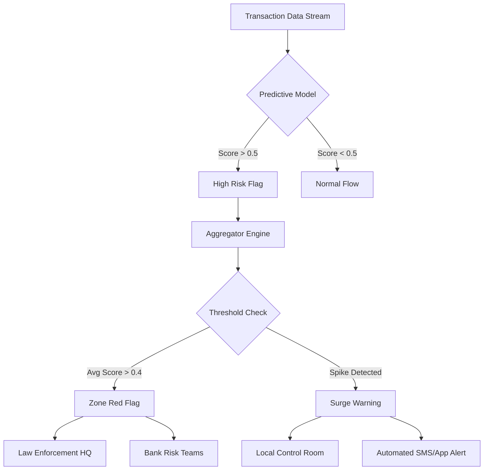

# Conceptual Alert & Notification Mechanism Design

This document outlines the architecture for a proactive alert system driven by cybercrime risk intelligence.

## 1. Alert Thresholds & Logic

The system triggers alerts based on two primary signals derived from the predictive model and real-time data aggregation.

### A. Static Risk Threshold (High-Risk Zone)
*   **Metric**: `Avg_Risk_Score` (computed daily/weekly)
*   **Condition**: `Avg_Risk_Score > 0.40` (configurable)
*   **Logic**: Identifies chronic hotspots where the probability of fraud is consistently high.
*   **Purpose**: Strategic resource allocation (long-term).

### B. Dynamic Anomaly Threshold (Spike Alert)
*   **Metric**: Rate of High-Risk Predictions (Hourly/Daily)
*   **Condition**: `Current_High_Risk_Count > (7_Day_Moving_Average + 2 * Standard_Deviation)`
*   **Logic**: Detects sudden surges in fraudulent activity in a specific location (e.g., a coordinated attack or mule ring activation).
*   **Purpose**: Immediate tactical response (real-time).

## 2. Alert Types & Recipients

| Alert Type | Severity | Trigger | Intended Recipient | Recommended Action |
| :--- | :--- | :--- | :--- | :--- |
| **Zone Red Flag** | High | `Avg_Risk_Score > 0.4` | **Strategic Command (Police/Cyber Cell)** | Deploy specialized task force; Coordinate with local ISPs/Banks for enhanced monitoring. |
| **Bank Watchlist** | Medium | `Avg_Risk_Score > 0.3` | **Financial Institutions (Risk Dept)** | Tighten transaction limits for ATMs/POS in this city; Enable 2FA for high-value withdrawals. |
| **Surge Warning** | Critical | `High_Risk_Count Spike` | **Local Law Enforcement & Field Units** | Immediate on-ground verification; Monitor CCTV feeds at prominent ATMs; Intercept potential mules. |

## 3. Recommended Actions Workflow

### Scenario: High Priority Monitoring Zone (e.g., Mumbai)
1.  **System**: detect `Avg_Risk_Score = 0.44` (Threshold Exceeded).
2.  **Notification**: Send "Zone Red Flag" to Cyber Cell HQ.
3.  **Action**: 
    *   HQ marks Mumbai as a "Enhanced Surveillance Zone".
    *   Local banks are notified to flag transactions > ₹50,000 originating here.
    *   Predictive patrolling routes are updated to cover high-density ATM clusters.

### Scenario: Sudden Spike (e.g., Jaipur at 2 AM)
1.  **System**: 50 high-risk transactions detected in 1 hour (vs normal 5).
2.  **Notification**: Send "Surge Warning" to Jaipur Control Room.
3.  **Action**:
    *   Dispatch patrol cars to active ATM clusters.
    *   Temporarily freeze non-2FA withdrawals in the geofence.

## 4. Visual Workflow

